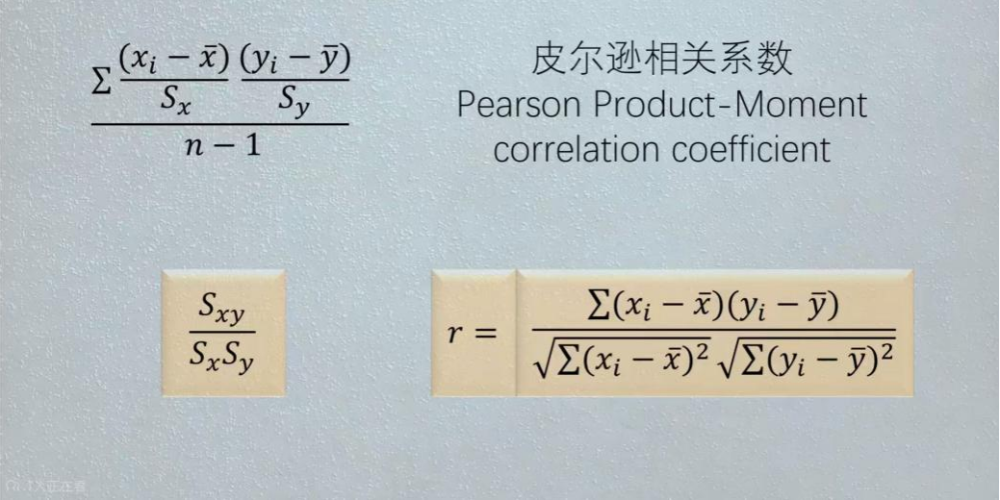
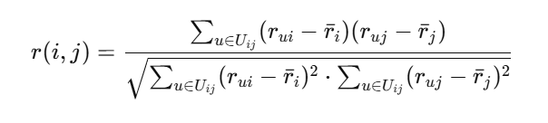
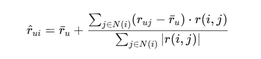
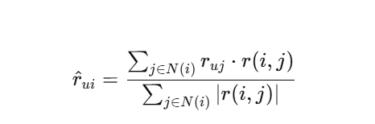

# 使用基于物品的协同过滤算法构建电影推荐系统（MovieLens数据集）

## Item_based_CF算法简介
Item-based Collaborative Filtering (基于物品的协同过滤) 算法通过计算物品之间的相似度来进行推荐。首先，构建用户-电影评分矩阵，然后利用皮尔逊相关系数衡量物品之间的相似度。预测某用户对电影的评分时，基于该用户对其他相似电影的评分以及这些电影之间的相似度进行加权计算。该算法通过基准评分和相似度加权评分的组合，预测目标用户可能的兴趣，广泛应用于个性化推荐系统中。

### 概念与公式
- 皮尔逊相关系数：协方差/各自标准差，通过归一化解决量纲差异大问题，取值在-1到1之间，越接近1说明越相似

- 电影相似度计算：构建用户-电影的评分矩阵，然后电影两两之间用皮尔逊相关系数公式计算电影的相似度

- 预测用户u对电影的评分：
  * 基准评分：ru是用户u对所有电影的平均评分
  * 分子项：筛选近邻电影（u用户评分过且与目标电影正相关的电影），近邻电影相似度*（用户u近邻电影的评分-用户u的平均评分）
  * 分母项：近邻客户的相似度数据绝对值和进行相似度归一化


- 第二种预测公式：这里不用用户u的平均评分，而是直接用相似度和近邻电影的评分进行计算，作者对这两种方式进行了实验，发现这种方法在处理“用户-电影评分稀疏矩阵”时，效果不好预测的评分都非常低，所以采用上面基准评分+偏差的计算方法。



## 基于Item_based_CF算法实现电影推荐功能

### 数据集加载，转换为用户-电影评分矩阵
```
def load_data(ra_data_path,cache_path):
    print('开始分批加载数据集...')
    if not os.path.exists(ra_cache_dir):
        os.makedirs(ra_cache_dir)

    if os.path.exists(cache_path):
        print('加载缓冲中...')
        ratings_matrix = pd.read_pickle(cache_path)
        print('从缓存加载数据集完毕')
    else:
        dtype = {'userId': np.int32, 'movieId': np.int32, 'rating': np.float32}
        print('加载新数据中')
        #加载前三列数据：用户ID、电影ID、评分
        ratings = pd.read_csv(ra_data_path,dtype=dtype,usecols=range(3))
        #转换为用户-电影评分矩阵
        ratings_matrix = pd.pivot_table(data=ratings,index=['userId'],columns=['movieId'],values='rating')
        ratings_matrix.to_pickle(cache_path)
        print('数据加载完毕')
    return ratings_matrix
ratings_matrix = load_data(ra_data_path,cache_path)
print(ratings_matrix.shape)
print(ratings_matrix.head())
```

### 电影相似度计算
```
def compute_persion_similarity(ratings_matrix):
    item_similarity_cache_path = os.path.join(ra_cache_dir,'item_similarity_cache')

    #基于皮尔森相关系数计算相似度
    if not os.path.exists(ra_cache_dir):
        os.makedirs(ra_cache_dir)
    if os.path.exists(item_similarity_cache_path):
        print('正从缓存加载物品相似度矩阵')
        similarity = pd.read_pickle(item_similarity_cache_path)
    else:
        print('开始计算物品相似度矩阵')
        similarity = ratings_matrix.corr()
        similarity.to_pickle(item_similarity_cache_path)
    print('物品相似度矩阵加载完毕')
    return similarity

item_similar = compute_persion_similarity(ratings_matrix)
print('用户相似度矩阵预览和大小')
print(item_similar.shape)
print(item_similar.head())
```

### 预测评分函数（基于物品协同过滤）：item-based CF
公式：用户u对电影的平均评分+近邻电影加总（近邻电影相似度*（用户u对近邻电影评分-用户u电影平均评分））/相似度

```
def predict_itemBasedCF(uid,iid,ratings_matrix,item_similar):
    #找到与电影u相似的近邻电影(正相关)
    similar_items = item_similar[uid].drop(labels=[uid]).dropna()
    similar_items = similar_items.where(similar_items>0).dropna()

    if similar_items.empty is True:
        raise Exception('电影{}没有相似的电影'.format(uid))

    #从近邻电影中找出u客户评分过电影，构建近邻电影序列
    id_item = set(ratings_matrix[uid].dropna().index) & set(similar_items.index)
    finally_similar_items = similar_items.loc[list(id_item)]
    #print(f'finally_similar_items{finally_similar_items}')

    # 计算用户u的平均评分
    user_ratings = ratings_matrix.loc[uid].dropna()
    user_mean_rat = user_ratings.mean()

    #（5）公式计算
    sum_up = 0
    sum_down = 0
    for sim_itemid,similarity in finally_similar_items.items():
        #用户u对近邻相似电影评分
        user_rated_movies = ratings_matrix.loc[uid,sim_itemid]

        # 分子计算
        if pd.notna(user_rated_movies):
            sum_up += similarity * (user_rated_movies-user_mean_rat)
        # 分母计算
        sum_down += abs(similarity)

    # 最后将所有相似物品累加再除分母相似度累加
    if sum_down == 0:
        print('分母为0不可计算')
        raise None
    predict_rating = user_mean_rat + sum_up / sum_down
    predict_rating = min(predict_rating, 5)
    return round(predict_rating, 2)
```

### 根据筛选条件来预测未看过电影的评分
```
def itemBase_predict_all(uid,item_ids,ratings_matrix,item_similarity):
    for iid in item_ids:
        if pd.notna(ratings_matrix.loc[uid,iid]):
            continue#如果已经评分就跳过该电影不进行预测
        try:
            rating = predict_itemBasedCF(uid,iid,ratings_matrix,item_similarity)
        except Exception as e:
            print('基于物品的协同过滤算法无法预测结果')
        else:
            yield uid,iid,rating


def predict_all(uid,ratings_matrix,similar_matrix,filter_rule=None):
    # 获取用户评分数据
    user_ratings = ratings_matrix.loc[uid]
    # 筛选用户未评分的电影
    unrated_movies = user_ratings[user_ratings.isna()].index

    if not filter_rule:
        # 筛选用户没有评分的电影
        item_ids = unrated_movies

    # 筛选掉非热门电影
    elif filter_rule == 'unhot':
        count = ratings_matrix.count()
        hot_movies = count.where(count > 10).dropna().index
        # 确保只预测用户未评分且是热门电影
        item_ids = set(unrated_movies) & set(hot_movies)

    # 筛选低评分的电影
    elif filter_rule == 'rated':
        user_ratings = ratings_matrix.loc[uid]
        high_rate__movies = user_ratings[user_ratings > 2.5].index
        # 确保只预测用户未评分且是高分电影
        item_ids = set(unrated_movies) & set(high_rate__movies)

    # 筛选掉非热门且无评分电影
    elif set(filter_rule) == set(['unhot', 'rated']):
        count = ratings_matrix.count()
        ids1 = count.where(count > 10).dropna().index
        user_ratings = ratings_matrix.loc[uid]
        ids2 = user_ratings[user_ratings > 2.5].index
        item_ids = set(ids1) & set(ids2) & set(unrated_movies)
    else:
        raise Exception('无效的筛选参数')
    yield from itemBase_predict_all(uid, item_ids, ratings_matrix, similar_matrix)
```
### 预测电影评分
```
def topk_itemBase_predict(k,filter_rule=None):
    results = predict_all(1,ratings_matrix,item_similar,filter_rule)
    results = sorted(results,key=lambda x:x[2],reverse=True)[:k]
    print('基于物品的协同过滤评分预测，预测用户评分最高的10部电影为：')
    for uid,itemid,predict_rating in results:
        print('预测出用户{}对电影{}的评分为：{:.2f}'.format(uid, itemid, predict_rating))
    return results
topk_itemBase_predict(10,filter_rule='unhot')
```

### 输出结果
```
基于物品的协同过滤评分预测，预测用户评分最高的10部电影为：
预测出用户1对电影2的评分为：4.36
预测出用户1对电影122882的评分为：4.36
预测出用户1对电影5的评分为：4.36
预测出用户1对电影122886的评分为：4.36
预测出用户1对电影7的评分为：4.36
预测出用户1对电影9的评分为：4.36
预测出用户1对电影10的评分为：4.36
预测出用户1对电影11的评分为：4.36
预测出用户1对电影12的评分为：4.36
预测出用户1对电影81932的评分为：4.36
```

## 总结：基于电影的协同过滤算法优缺点
- 优点：物品相似度更稳定，适合物品数量较少，用户评分稀疏场景
- 缺点：
  * 基于物品的协同过滤依赖于电影之间的相似度矩阵，实验数据集有610个用户对9742个电影进行评分，总共评分10万条，出现了电影多但电影评分不足的情况，大量电影没有得到足够的评分导致相似度矩阵不可靠，这种情况用基于用户的协同过滤或矩阵分解算法进行评分预测效果都比较好，感兴趣的朋友可以看我关于这两个算法的实验帖子。
  * 冷启动问题（新物品缺乏评分）